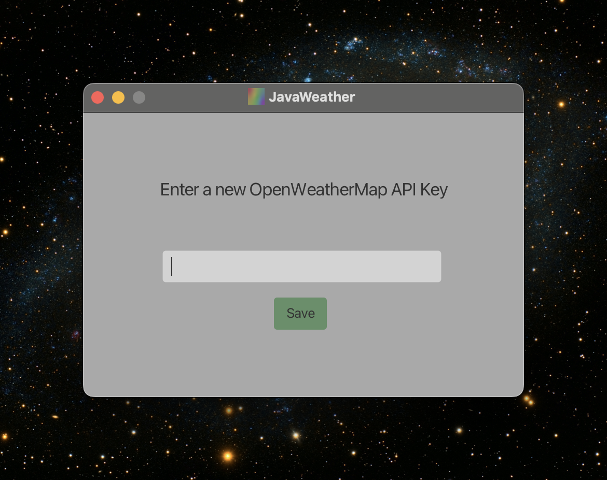
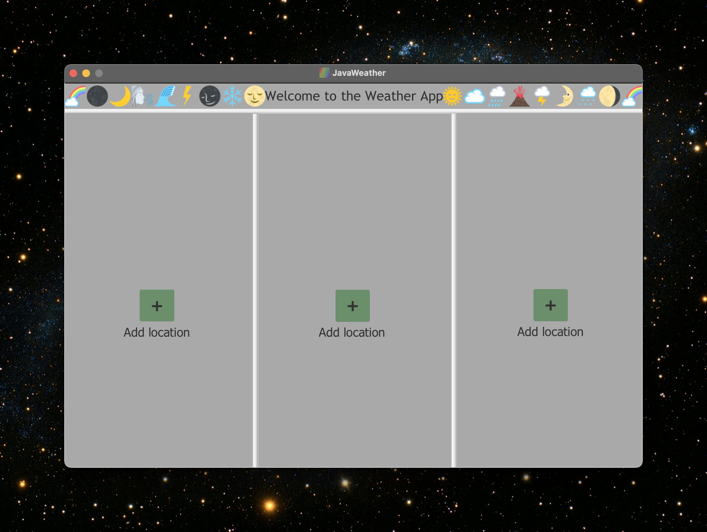
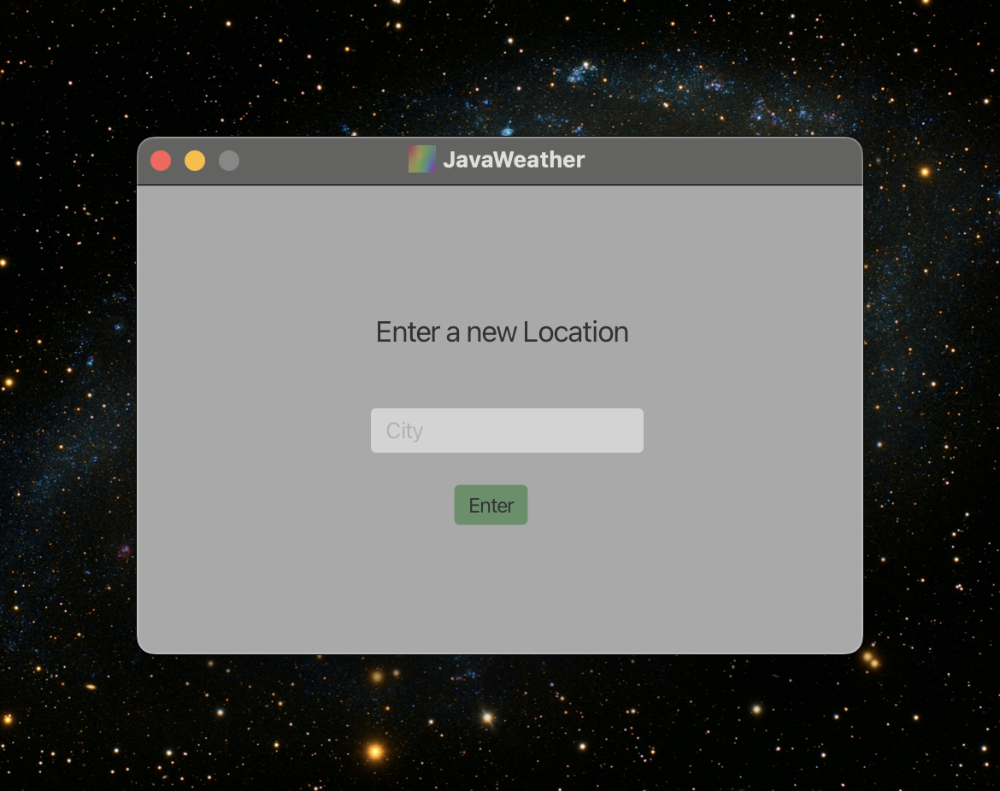
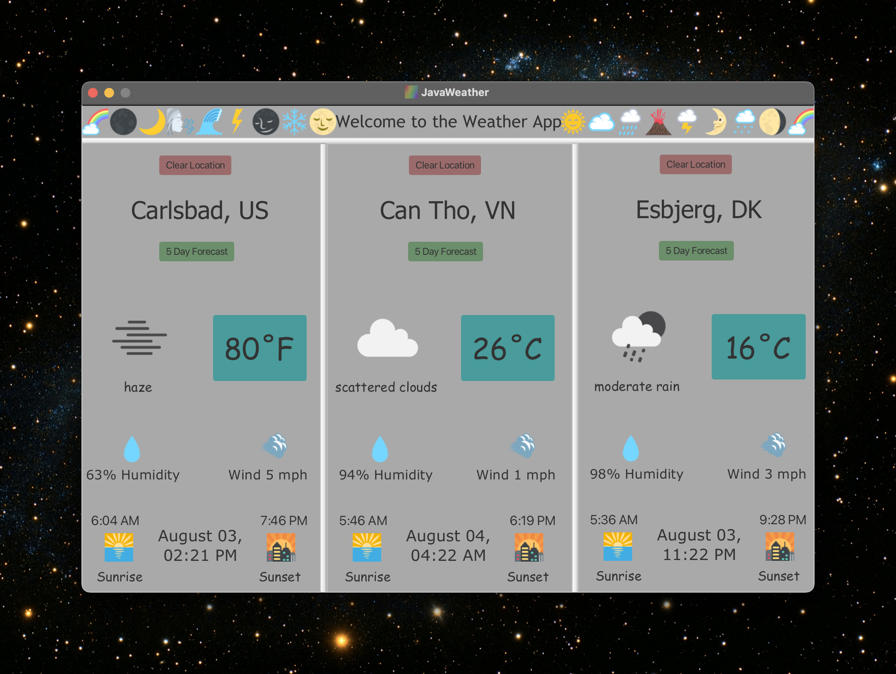
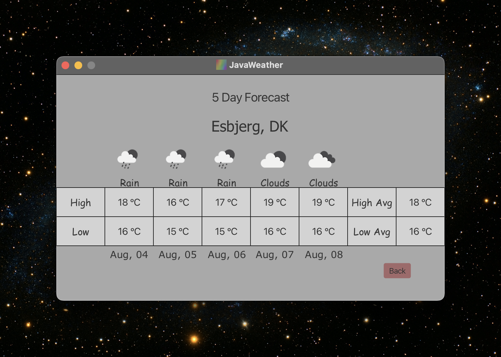
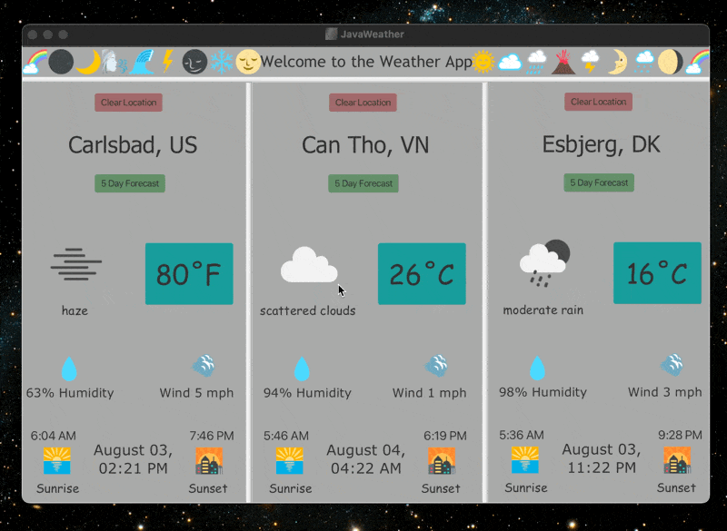

# JavaWeather

    - JavaWeather is a simple weather application displaying weather data to a GUI built using JavaFX. 
    - It collects and displays current weather data and a 5-day forecast for a specified location using the free OpenWeatherMap API.

## Features

    - Displays current weather conditions including temperature, humidity, wind speed, sunrise times, sunset times, current time and date.
    - **Temperature Unit Toggle**: Click any temperature display to toggle between Fahrenheit (°F) and Celsius (°C) independently for each location.
    - Provides a 5-day weather forecast with high and low temperatures, weather conditions, and icons.
    - Allows users to add, remove and view weather for multiple locations.
    - Graphical user interface designed using JavaFX.

## Requirements

    - Java version: 21
    - JavaFX: 21.0.5
    - Apache Maven 3.9.8+
    - See `pom.xml` for the full list of dependencies using Maven.

## Setup

    1. Create your own OpenWeatherMap.org free API key
    2. **Clone the repository:**
    3. Add JavaFX and other dependencies: Ensure your project is set up to use JavaFX and the other dependencies specified in pom.xml.

## Project Structure

    src/
        |-- main/
        |   |-- java/
        |   |   |-- javaweathers/
        |   |   |   |-- AddLocationController.java: Controller for adding a new location.
        |   |   |   |-- AddWeatherApiController.java: Controller for adding a new weather API key.
        |   |   |   |-- ConfigManager.java: Cross-platform configuration management.
        |   |   |   |-- Day.java: Represents a single day's weather data.
        |   |   |   |-- FiveDayForecastController.java: Controller for the 5-day forecast view.
        |   |   |   |-- Forecast.java: Collects and parses the 5-day weather forecast data.
        |   |   |   |-- Launcher.java: Ensures JavaFX application runs properly.
        |   |   |   |-- MainApplication.java: The main entry point of the application.
        |   |   |   |-- MainController.java: Controller for the main application view.
        |   |   |   |-- Weather.java: Collects and parses the current weather data.
        |   |-- resources/
        |   |   |-- javaweathers/
        |   |   |   |-- icons/: Contains the icon files for the application.
        |   |   |   |-- AddLocationView.fxml: FXML file for the add location view.
        |   |   |   |-- AddWeatherApiView.fxml: FXML file for the add weather API key view.
        |   |   |   |-- FiveDayForecastView.fxml: FXML file for the 5-day forecast view.
        |   |   |   |-- main-view.fxml: FXML file for the main application view.
        |-- test/
        |   |-- java/
        |   |   |-- javaweathers/
        |   |   |   |-- WeatherTest.java: Unit tests for the Weather class.
        |   |   |   |-- ForecastTest.java: Unit tests for the Forecast class.
        |   |   |   |-- MainControllerTest.java: Unit tests for the MainController class.
        |   |   |   |-- DayTest.java: Unit tests for the Day class.
        |   |   |   |-- AddLocationControllerTest.java: Unit tests for the AddLocationController class.
        |   |   |   |-- FiveDayForecastControllerTest.java: Unit tests for the FiveDayForecastController class.
        |   |   |   |-- TestApp.java: TestFX application helper for UI testing.

## Screenshots

### API Input

### Blank Menu

### Add Location

### Populated Menu

### 5 Day Forecast

### Demo - Temperature Toggle Feature

## Usage

    - Start the application:
        When the application starts, it will prompt you to enter your OpenWeatherMap API key. Once entered, the key is saved locally and will not be requested again unless the file is deleted or modified.

    - Add a location:
        Enter the city name in the "Add Location" screen.
        Click the "Enter" button to collect and display the weather data.

    - Toggle temperature units:
        Click on any temperature display to switch between Fahrenheit (°F) and Celsius (°C). Each location maintains its own temperature unit preference.

    - View the forecast:
        Click on the "Forecast" button to view the 5-day weather forecast.

    - Clear the weather data:
        Click on the "Clear" button to remove the weather data for the specified location.

## Version History

### v1.1.0 - Temperature Unit Toggle
    - Added clickable temperature displays that toggle between Fahrenheit (°F) and Celsius (°C)
    - Independent temperature unit preferences for each weather location panel
    - Enhanced UI with cohesive muted color scheme (Muted Teal, Dusty Rose, Forest Green)
    - Temperature unit preferences persist across view transitions
    - Bug fixes: FXML version compatibility and temperature unit persistence

### v1.0.0 - Initial Release
    - Core weather application functionality
    - OpenWeatherMap API integration
    - 5-day forecast display
    - Multi-location support

## License

    - This project is licensed under the MIT License.

## Acknowledgments

    - OpenWeatherMap for providing the weather data API.
    - Emoji support provided by EmojiTextFlow and EmojiTwo.
